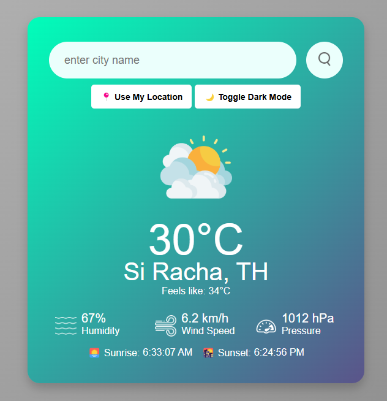
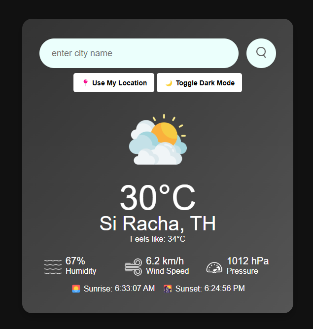

# 🌤️ Weather App

A simple and responsive **Weather App** that provides real-time weather updates based on city search or your current location. The app fetches data from the **OpenWeather API** and displays temperature, humidity, wind speed, pressure, sunrise, and sunset times.

---

### 🚀 Features

✅ **Real-time weather updates** using OpenWeather API  
✅ **Search by city name**  
✅ **Geolocation support** (Fetches weather for your current location)  
✅ **Dark Mode Toggle** 🌙  
✅ **Responsive design** for desktop and mobile  
✅ **Weather icons based on conditions** (Clear, Cloudy, Rainy, etc.)  
✅ **Displays Feels-like temperature**  
✅ **Displays Sunrise & Sunset times**

---

### 🛠️ Technologies Used

- **HTML5** - Structuring the app
- **CSS3** - Styling and responsiveness
- **JavaScript (ES6)** - Handling API calls and UI interactions
- **OpenWeather API** - Fetching real-time weather data

---

### 🎯 Installation & Setup

1. **Clone the repository**

   ```bash
   git clone https://github.com/Minkeez/html-css-js-weather-app-greatstack.git
   ```

2. **Open `index.html` in your browser**
   ```bash
   open index.html  # macOS
   start index.html  # Windows
   ```
   Or manually open the file in your browser.

---

## 🌐 API Key Setup

This project uses the **OpenWeather API**. You need to add your API key:

1. **Get an API Key** from [OpenWeather](https://openweathermap.org/api)
2. **Replace the API key** in `script.js`:
   ```js
   const apiKey = "YOUR_API_KEY_HERE";
   ```

---

## 🖼️ Screenshots

| Light Mode                          | Dark Mode                         |
| ----------------------------------- | --------------------------------- |
|  |  |

---

## 🤝 Contributing

Want to improve this project? Follow these steps:

1. **Fork this repository**
2. **Create a new branch**
   ```bash
   git checkout -b feature-name
   ```
3. **Make changes and commit**
   ```bash
   git commit -m "Added new feature"
   ```
4. **Push the branch to GitHub**
   ```bash
   git push origin feature-name
   ```
5. **Open a Pull Request**

---

## 📜 License

This project is **open-source** and available under the [**MIT License**](LICENSE).

---

## 🎉 Acknowledgments

- **GreatStack** - Original tutorial inspiration [here](https://www.youtube.com/@GreatStackDev)
- **OpenWeather API** - Weather data provider
- **Icons** - [Icons8](https://icons8.com)

---

## 🌟 Show Your Support

If you like this project, **give it a star ⭐ on GitHub**! 😃
